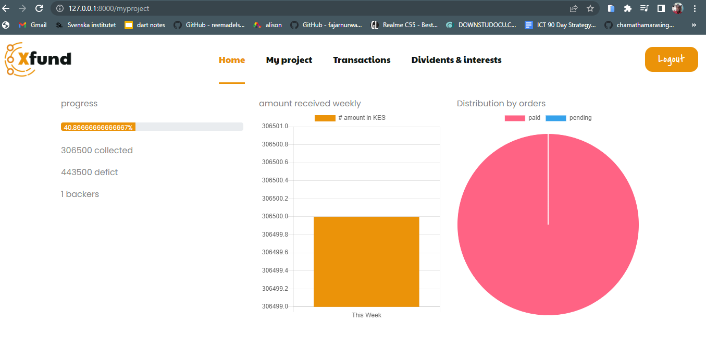
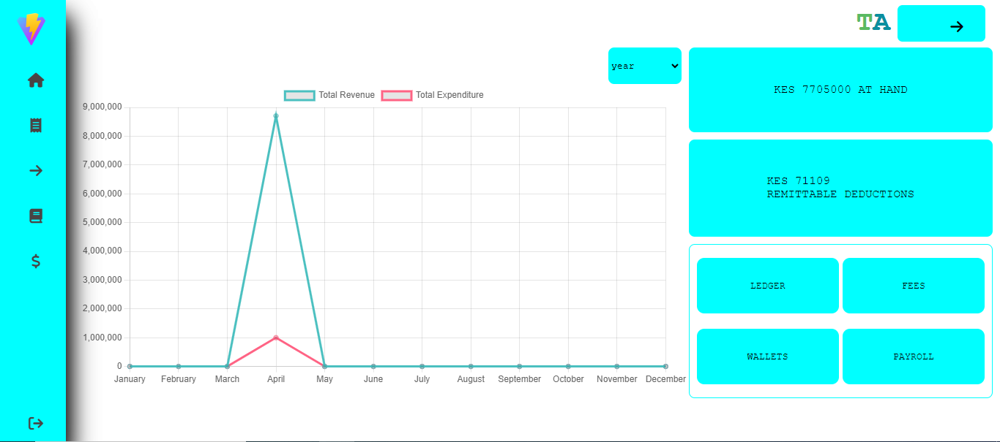

<div align="center">

  [](https://chanmeng.live/)
  [](https://www.linkedin.com/in/mwendwaharry/)

</div>

<details>
<summary><h2>🤞 My Promise</h2></summary>

```java
while (isAwake) {
    code();
    learn();
    create();
    repeat();
}
```
</details>


<!-- Featured Projects Section -->
<table>
<tr>
<td width="50%">
<h3 align="center">shulea learn</h3>
<div align="center">  
<a href="http://shulea-learn-frontend.vercel.app/" target="_blank">

</a>
<br>
<br>
<p>
<a href="#" target="_blank">

</a>
<a href="http://shulea-learn-frontend.vercel.app/" target="_blank">

</a>
</p>
<p align="left">
• An operating system for tutors which enables them create lessons , enroll learners and train on the platform<br>
• Live streaming and live data content layers<br>
• paystack integration and ability to switch from tutor to learner profiles
</p>
</div>
</td>
<td width="50%">
<h3 align="center">xfund crowdfunding app</h3>
<div align="center">  
<a href="#" target="_blank">

</a>
<br>
<br>
<p>
<a href="https://github.com/muiam/fouth-year-project" target="_blank">

</a>
<a href="#" target="_blank">

</a>
</p>
<p align="left">
• A crowdfunding app for local kenyan startups<br>
• Login , registration and private dashboards for both startup founders and backers<br>
• mpesa integration with automatic financial reports
</p>
</div>
</td>
</tr>
<tr>
<td width="50%">
<h3 align="center">shulea school management system</h3>
<div align="center">  
<a href="#" target="_blank">

</a>
<br>
<br>
<p>
<a href="#" target="_blank">

</a>
<a href="https://shulea.com/" target="_blank">

</a>
</p>
<p align="left">
• school management saas for kenyan schools with parent , teachers , finance and head teacher dashboards<br>
• academic management , student management and finance management for both students and teachers payslips<br>
• Financial reporting with  finance ledges and mpesa integration for fee payments
</p>
</div>
</td>
<td width="50%">
<h3 align="center">Chriana facility management</h3>
<div align="center">  
<a href="#" target="_blank">

</a>
<br>
<br>
<p>
<a href="#" target="_blank">

</a>
<a href="https://www.chrianafacilitymanagement.co.ke/" target="_blank">

</a>
</p>
<p align="left">
• SEO optimization<br>
• Admin dashboard for processing orders<br>
• Inbuilt mailer and a contact management system for keeping intouch with clients
</p>
</div>
</td>
</tr>
<tr>
<td width="50%">
<h3 align="center">Jubilee college</h3>
<div align="center">  
<a href="https://jubileecollege.ac.ke/" target="_blank">

</a>
<br>
<br>
<p>
<a href="#" target="_blank">

</a>
<a href="https://jubileecollege.ac.ke/" target="_blank">

</a>
</p>
<p align="left">
• A website with student courses application feature<br>
• A students portal for handling students academic data and finance<br>
• An admin portal for overall school management
</p>
</div>
</td>

</tr>
</table>


<details open>
  <summary><h3>🎯 Core Skills</h3></summary>

       

</details>

<details>
  <summary><h3>🌐 Frontend Development</h3></summary>

      

</details>

<details>
  <summary><h3>🔙 Backend Development</h3></summary>

         

</details>


<div align="center">
  
  
</div>

<div align="center">
  
</div>

<h2 align="center">💡 Random Dev Quote</h2>

<div align="center">
  
</div>


<div align="center">
  <p><i>Thanks for visiting my GitHub profile! Feel free to connect or check out my projects.</i></p>
  <br>
</div>

<div align="center">

  [](https://chanmeng.live/)
  [](https://www.linkedin.com/in/mwendwaharry/)

</div>


